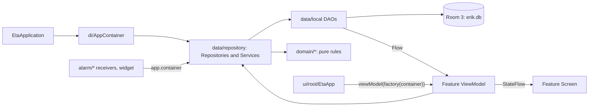

# Repository Guidelines

## Project Overview

Eta is an Android productivity app: a smart to-do list, a revolver/drag day and
week planner, a reward-points ledger, self-contracts, a standing (recurring)
schedule and a read-only Google Calendar import. One Gradle module (`:app`),
package `com.example.eta`, all UI text in German.

- **Behaviour spec:** `Eta_doc/*.md` (German, `Konzept.md` is the root). Point
  values, timeouts and phase mechanics come from there. Known doc error: the
  Achtsam multiplier is **1.0**. Other agreed deviations are listed in
  `CLAUDE.md` → *Confirmed design decisions*.
- **Engineering record:** `CLAUDE.md` (cross-cutting) plus one file per subject or
  round in `.claude/rules/*.md` (YAML `paths:` frontmatter; index table in
  `CLAUDE.md`). Read the subject's rule file before changing it. New rounds come
  from `update.txt` and are written up as `.claude/rules/step-N-….md`, with a row
  added to that table.
- **Legacy name ERIK — keep it:** `applicationId = "com.example.erik_iteration_2"`
  (installed-app identity, OAuth client), `EtaDatabase.NAME = "erik.db"` (file on
  the device and entry inside backup zips).

## Fork & Contribution Workflow

This checkout is a contributor fork. The owner develops alone with his own
assistant, and `CLAUDE.md` describes his routine.

| Remote | Repository | Use |
|---|---|---|
| `upstream` | `Erbsenherr/Eta_productivity_application` (the owner) | Fetch only; PRs target its `main` |
| `origin` | `Roden69/ETA` (this fork) | Push topic branches |

- **`CLAUDE.md`'s end-of-session routine does not apply here.** That routine is
  to commit directly on `main`, push, and leave an APK in `dist/`. In the fork:
  - work on a topic branch (currently `dev/daniel`) and never commit to `main`;
  - push to `origin` and open a PR against `upstream/main`;
  - build an APK only for a device you install it on yourself.
- **Sync** the topic branch with
  `git fetch upstream && git rebase upstream/main`. Never check out commits that
  still tracked `local.properties` or `dist/`: doing so once overwrote the
  ignored copies on disk and then deleted them.
- **One subject per PR.** Update the matching `.claude/rules/*.md` file (and the
  table in `CLAUDE.md`) in the same PR, as the owner does; his assistant relies
  on those files.
- **The agreed decisions are the owner's:** Foundation-only UI, no DI framework,
  no entity/model mappers, the legacy ids, and everything under *Confirmed design
  decisions*. Changing any of them starts with a conversation with him, not with
  a refactor PR.
- **Signing:** builds from a contributor machine carry that machine's debug key
  (see *Development Commands*).
  - They install on an emulator or your own phone as a fresh app with its own
    data.
  - They cannot update the owner's installed app.
  - Google Calendar sign-in fails on them until the owner adds an Android OAuth
    client for that key's SHA-1 and your Google account as a tester
    (`.claude/rules/google-calendar.md`).

## Architecture & Data Flow



- **Manual DI:** `EtaApplication.onCreate` builds a single `AppContainer`. Every
  repository and service in it is an eagerly constructed `val` with its
  dependencies passed to the constructor. Activities and receivers reach it
  through `application as EtaApplication` /
  `context.applicationContext as? EtaApplication`. There is no Hilt or Koin; a new
  service becomes another `val` in the container.
- **Definition vs. occurrence (learn this first):** `Item` is a definition
  (ToDo / Deadline / Recurring / Spend) and never says *when*. `PlannedBlock` is
  one occurrence on one date and is what gets checked off; its state is
  `completedAt`, `discardedAt`, or still open. `DayPlan` holds confirmation state
  only. `BlockOrigin` (`RECURRING` / `DRAGGED` / `CALENDAR_IMPORT`) decides the
  visuals and whether a block can be moved.
- **One block per item per day:** a unique index on `planned_blocks(itemId, date)`
  plus `PlannedBlockDao.insertMissing` (`OnConflictStrategy.IGNORE`). Never upsert
  materialized blocks.
- **Materialization:** `ScheduleMaintenance.topUp()` keeps
  `SCHEDULE_HORIZON_DAYS = 21` days laid down, using `expandRecurring`
  (`domain/recurrence/RecurrenceExpansion.kt`). Expansion is idempotent, skips
  definitions without a start time or duration, and respects vacations. Call it
  after any change to standing tasks or growth. Deleting a future block does
  **not** suppress an occurrence: set `discardedAt`, or make expansion aware of it.
- **Points:** the balance is the sum of `PointsTransaction` rows
  (`PointsDao.observeBalance()`), never a stored number. Points are computed only
  in `domain/reward/Yield.kt` (`yieldOf`, `plannedYield`). Only
  `ReevaluationService` writes `HARVEST` rows, so checking a task off credits
  nothing until the evening reevaluation.
- **Day lifecycle:** a planning alarm leads into the flows
  `Reevaluation → Concretize → Calendar → Planner`. `DayClosingService` handles
  discards and makes up missed recurring tasks; `ReevaluationService` handles the
  harvest, the settlement, contracts and growth.
- **Lists:** `Stage` is `COLLECTION` / `LOCKED` / `WEEK` / `DAY` / `DONE`.
  "Liste für Morgen" is the view of tomorrow's confirmed blocks, not a stage. The
  Erfolgsliste is built from completed blocks (`observeErfolgsliste`), not from
  `Stage.DONE`.
- **Recognise blocks by `Item.role` (`ItemRole`), never by id.**
  `SETUP_ITEM_ID_PREFIX = "setup:"` exists only so questionnaire items regenerate
  idempotently.
- **Alarms:** AlarmManager only (no WorkManager, no services). Each alarm kind
  in `alarm/` has a `<Kind>Alarm.kt` (scheduling, the `<Kind>AlarmContract`
  actions, the receiver) and a `<Kind>Coordinator` (what to ring, and when).
  Planning and wake alarms use `setAlarmClock`; task-start alarms and reminders use
  `setExactAndAllowWhileIdle`. Both fall back to `setWindow` when exact alarms are
  denied. Receivers call `goAsync()`, launch in `CoroutineScope(Dispatchers.Default)`
  and `finish()` in `finally`. Every notification goes through `postNotification`
  in `alarm/EtaSound.kt`, which keeps lint free of errors.
- **Google Calendar:** read-only. It uses `play-services-auth`'s
  `AuthorizationClient` plus hand-written HTTP in `data/calendar/GoogleCalendarApi.kt`
  (on `Dispatchers.IO`). Overlapping events count only once toward free time.

## Key Directories

| Path (under `app/src/main/java/com/example/eta/` unless rooted) | Purpose |
|---|---|
| `domain/<topic>/` | Rules as pure top-level functions (`planning`, `recurrence`, `reward`, `contract`, `streak`, `growth`, `reevaluation`, `vacation`, `reminder`, `subtask`, `staging`, `setup`). No Android imports, no `Clock.System`. |
| `domain/model/` | Room entities that are also the domain models. There is deliberately no mapper layer. |
| `data/local/` | `EtaDatabase` (version and every `MIGRATION_<from>_<to>`), DAOs, `Converters` |
| `data/repository/` | `*Repository` (CRUD and Flows) and `*Service` (use cases combining DAOs with domain rules) |
| `data/backup/`, `data/calendar/` | ZIP backup of the database; Google auth and the Calendar API |
| `alarm/` | Alarm scheduling, receivers, sounds, text-to-speech, the wake screen |
| `ui/<feature>/` | `<Feature>Screen.kt` + `<Feature>ViewModel.kt` + dialogs |
| `ui/components/`, `ui/theme/`, `ui/format/` | Foundation-only design system (`EtaButton`, `EtaSurface`, `EtaScreen`, `EtaDialog`, `EtaTabBar`); `EtaTheme`, `AppDesign`, `Brightness`, `DesignStore`; `Formatting.kt` (including `formatSignedPoints`) |
| `widget/` | The Quick-Add AppWidget and `QuickAddActivity` |
| `app/schemas/com.example.eta.data.local.EtaDatabase/` | Exported schemas `1.json` … `21.json`, committed |
| `app/src/main/res/raw/` + root `sounds/` | The shipped MP3s and their source copies. Keep the two in sync by hand. |
| `dist/` (ignored) | Signed APK history, never deleted |

## Development Commands

Windows (PowerShell, `JAVA_HOME`/`ANDROID_HOME`, `gradlew.bat`) is covered in
`CLAUDE.md` → *Build*. On the Linux workstation:

- `gradlew` is committed without the exec bit (mode `100644`), so run it as
  `bash gradlew …`.
- JDK 25 is required (`gradle/gradle-daemon-jvm.properties`: `toolchainVersion=25`).
  The system `/usr/bin/java` (OpenJDK 25) works with `JAVA_HOME` unset.
- The SDK path comes from the untracked `local.properties`
  (`sdk.dir=/home/dmatthes/Android/Sdk`). If that file is missing, the build fails
  at configuration time with "SDK location not found".

```bash
bash gradlew assembleDebug
bash gradlew testDebugUnitTest
bash gradlew testDebugUnitTest --tests "*.YieldTest"
bash gradlew lint                               # findings: app/build/reports/lint-results-debug.xml
bash gradlew assembleRelease                    # full compile; catches release-only breaks
bash gradlew compileDebugKotlin --rerun-tasks   # after changing a shared type
```

**Release APK (the owner's routine).** The owner ends every session that changes
code with a signed release APK in `dist/` (see `CLAUDE.md`). The Linux
equivalent, once the suite, `assembleRelease` and `lint` are green:

```bash
bt=~/Android/Sdk/build-tools/36.0.0            # Windows uses 36.1.0
mkdir -p dist
"$bt/apksigner" sign --ks "$KS" --ks-pass pass:android --key-pass pass:android \
  --ks-key-alias androiddebugkey \
  --out "dist/eta-release-$(date +%Y-%m-%d-%H%M).apk" \
  app/build/outputs/apk/release/app-release-unsigned.apk
```

- `$KS` is the keystore you sign with. An update installs over the owner's
  phone only if it is signed with **his** debug keystore
  (`%USERPROFILE%\.android\debug.keystore` on his Windows machine).
- The flatpak Android Studio keystore on this workstation is a different key:
  `~/.var/app/com.google.AndroidStudio/config/.android/debug.keystore`, generated
  on 2026-10-06, SHA-1 `9B:01:34:B2:…:5D:9B`. The same applies to `app-debug.apk`
  and to Android Studio's "Run".
- **Never uninstall to get around a signature mismatch:** that wipes `erik.db`.
- To check a key, run `"$bt/apksigner" verify --print-certs <apk>`.
- `adb` is on `PATH`. The AVD `Pixel_8` is listed with
  `ANDROID_AVD_HOME=~/.var/app/com.google.AndroidStudio/config/.android/avd ~/Android/Sdk/emulator/emulator -list-avds`;
  to start it, run the same command with `-avd Pixel_8` instead of `-list-avds`.
  A fresh emulator install has no signature conflict.

## Code Conventions & Common Patterns

- **Language:** UI strings are German and hard-coded in Kotlin (`strings.xml`
  holds only the app and manifest basics). Identifiers, comments, KDoc and commit
  messages are English. Comments explain *why*, citing the rule or the bug behind
  the code; keep that style. `kotlin.code.style=official`.
- **Naming:**
  - Classes and files: `*Screen`, `*ViewModel`, `*Repository`, `*Service`, `*Dao`,
    `*Coordinator`, `*Alarm`.
  - Outcomes are sealed interfaces `*Result` / `*Outcome` / `*Feedback`
    (`AddItemResult`, `SyncOutcome`, `BackupResult`, `PlacementFeedback`).
  - Companion factories: `Item.newTodo(…)`, `Item.newMakeUpTodo(…)`.
  - Migrations: `MIGRATION_<from>_<to>`.
  - Small testable helpers are `internal`.
- **ViewModels:** the constructor takes repositories and services plus
  `clock: Clock = Clock.System` and `timeZone: TimeZone = TimeZone.currentSystemDefault()`.
  The same file exports
  `fun <feature>ViewModelFactory(container: AppContainer): ViewModelProvider.Factory = viewModelFactory { initializer { … } }`.
  `ui/root/EtaApp.kt` obtains each one with
  `viewModel(key = "<feature>-$dateKey", factory = …)`; the date in the key
  recreates the ViewModel when the day changes.
- **State:** expose `StateFlow` built with `combine` / `map` and
  `.stateIn(viewModelScope, SharingStarted.WhileSubscribed(5_000), initial)`.
  Collect it with `collectAsStateWithLifecycle()`; nothing uses plain
  `collectAsState`. Dialog and form state lives in `remember` / `rememberSaveable`.
- **Navigation:** there is no Navigation library. `EtaApp.kt` switches on three
  types:
  - `RootDestination` (`Loading` / `Setup` / `Dashboard`)
  - `AppFlow`, the multi-step phases (`Planner`, `PlannerToday`, `WeekPlanner`,
    `WeekTopUp`, `Reevaluation`, `Concretize`, `Calendar`, `Vacation`)
  - `EtaTab` (`Today`, `Lists`, `Contracts`, `Reminders`, `Growth`, `Settings`)
- **Time:**
  - Types: `kotlin.time.Instant` / `Clock` (never `kotlinx.datetime.Instant`),
    `kotlinx.datetime.LocalDate` / `LocalTime` / `TimeZone`, and `Duration`
    literals.
  - Domain functions receive `now` / `today` / `zone` as parameters and never read
    the system clock.
  - Instants are stored as epoch millis (`Converters.kt`).
- **Async:** DAO reads return `Flow`; writes and service calls are `suspend`.
  Network calls run on `Dispatchers.IO`. App-level jobs use
  `CoroutineScope(SupervisorJob() + Dispatchers.Default)`.
- **Errors:**
  - Expected absence is a nullable return.
  - User-visible results are sealed outcomes carrying German messages.
  - `runCatching` / `try` appear only at Android boundaries (alarms, sound,
    network).
  - There is no logging framework.
- **Models:**
  - Ids are UUID strings (`UUID.randomUUID().toString()`).
  - Every row has `createdAt` / `updatedAt`, and updates use
    `copy(updatedAt = clock.now())`.
  - Computed properties need `@get:Ignore`.
  - Enums are stored by name, so a new enum value needs no migration.
- **Changing the schema:**
  1. Bump `version` in `data/local/EtaDatabase.kt` and add
     `val MIGRATION_<n>_<n+1>` there.
  2. Register it in `AppContainer`'s `.addMigrations(…)`.
  3. Build, so that `app/schemas/…/<n+1>.json` is exported.
  4. Diff the hand-written SQL against that JSON. A mismatch crashes at runtime
     when the database opens.
  5. Add a row to `.claude/rules/database.md`.

### Toolchain gotchas

- AGP 9 has Kotlin built in: there is no `kotlin-android` plugin. Keep
  `android.disallowKotlinSourceSets=false` until KSP moves to `android.sourceSets`.
- Room 3 (`androidx.room3`) differs from Room 2:
  - Converters use `@ColumnTypeConverter(s)`.
  - `@Relation(parentColumns = [..], entityColumns = [..])` takes arrays.
  - A `[MissingType]` error means a wrong import; temporarily removing
    `@ColumnTypeConverters` shows the real error.
  - Check the API with `javap` instead of guessing.
- Core library desugaring is mandatory: `kotlinx-datetime` resolves to
  `java.time`, which minSdk 24 lacks.
- Incremental compilation hides errors in files it does not revisit. Verify
  changes to a shared type with `assembleRelease` or `--rerun-tasks`.
- Callbacks take the plain `(T) -> R` shape, never `(T.() -> R) -> Unit`.
- R8 is off (`optimization.enable = false`). Keep rules would go in
  `app/src/main/keepRules/rules.keep`.

### Compose traps

- Foundation only, with no Material3. Material 1 sits on the *debug* classpath
  through `ui-tooling`, so a stray `androidx.compose.material.*` import compiles in
  debug and breaks release.
- `pointerInput` lambdas must never read values from the enclosing composition.
  Go through `State`, `rememberUpdatedState`, and stable ids (`move(blockId)` looks
  the row up itself).
- Lists of stateful items need `key(item.id)`.
- Inside `semantics { }`, never name a parameter `contentDescription`: the
  self-assignment compiles and throws at runtime. Call it `label`.

## Important Files

- `app/src/main/AndroidManifest.xml`: declares `EtaApplication`, `MainActivity`
  (`singleTask`), `QuickAddActivity`, `WakeAlarmActivity`, the widget provider,
  four alarm receivers and `BootCompletedReceiver`.
- `EtaApplication.kt`, `MainActivity.kt`, `ui/root/EtaApp.kt`,
  `ui/root/RootViewModel.kt`: startup, rescheduling alarms on start, the root
  navigation.
- `di/AppContainer.kt`: the whole object graph and the migration list.
- `data/local/EtaDatabase.kt`, `PlannedBlockDao.kt`, `PointsDao.kt`,
  `Converters.kt`.
- `data/repository/ScheduleMaintenance.kt`, `PlanRepository.kt`,
  `ItemRepository.kt`, `DayClosingService.kt`, `ReevaluationService.kt`.
- `domain/model/Item.kt`, `PlannedBlock.kt`, `ItemType.kt` (`ItemRole`);
  `domain/recurrence/RecurrenceExpansion.kt`; `domain/reward/Yield.kt`;
  `domain/setup/SetupItems.kt`.
- `alarm/EtaSound.kt`: sound channels and `postNotification`.
- `gradle/libs.versions.toml`, `app/build.gradle.kts`, `gradle.properties`,
  `settings.gradle.kts` (`FAIL_ON_PROJECT_REPOS`).

## Runtime/Tooling Preferences

- Gradle 9.5.0 (wrapper), AGP 9.3.2, Kotlin 2.2.10 (with
  `-opt-in=kotlin.time.ExperimentalTime` set globally), KSP 2.3.6, Compose BOM
  2026.02.01, Room 3.0.1, kotlinx-datetime 0.8.0, play-services-auth 22.0.0.
- Versions are pinned only in `gradle/libs.versions.toml`. The configuration
  cache is on.
- compileSdk and targetSdk 37, minSdk 24, Java 11 bytecode, JDK 25 for the Gradle
  daemon.
- Stay within the stack. Do not add:
  - a DI framework or another annotation processor
  - any Material library
  - mappers between entities and models
- Git: see *Fork & Contribution Workflow*.

## Testing & QA

- **Scope:** JVM unit tests only. They use JUnit 4 (`org.junit.Test`,
  `org.junit.Assert.*`) and live in `app/src/test/java/com/example/eta/{domain,ui}/`.
  The suite has **467 tests**, all passing as of 2026-10-06 on Linux.
- **What they cover:** pure functions only — domain rules, the design maths in
  `ui/theme`, and `ui/format`. There are no fakes, mocks, Robolectric or
  coroutines-test; no DAO, migration, Compose or alarm tests.
  `androidTest/ExampleInstrumentedTest` is the template test, which checks the old
  `applicationId`.
- **House style:** a `<Subject>Test` class, method names as backticked sentences,
  private local factories (`item(…)`, `block(…)`, `contract(…)`) that build real
  models, and fixed dates:

  ```kotlin
  @Test
  fun `Fokus yields one point per hour`() {
      val item = todo(Category.FOKUS)
      assertEquals(2.0, yieldOf(item, block(item.id, 2.hours)), 0.0001)
  }
  ```

  Dates and times are written as `LocalDate(2026, 8, 21)`, `LocalTime(9, 0)`,
  `Instant.parse(…)`, `TimeZone.UTC` and `15.minutes`.
- **Making logic testable:** extract it into a pure function under `domain/` and
  test that; services stay thin orchestration.
- **Results:** `app/build/test-results/testDebugUnitTest/*.xml`. The console does
  not print a test count.
- **Done means** the suite, `assembleRelease` and `lint` are all green. Lint
  currently has no errors, so any new error is yours.
- **Hardware:** sounds, notification channels, alarms and colours are unverified
  on a real device unless a rule file says otherwise.
- **Open gaps:** a `MigrationTestHelper` test (`room3-testing` is already on the
  test classpath), Compose UI, alarms, Calendar.
