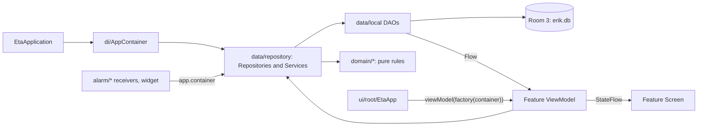

# Repository Guidelines

This file wins over `CLAUDE.md`, the owner's file for his own assistant, which
some harnesses also load. In this fork, `CLAUDE.md`'s session routine does **not**
apply: no APK in `dist/`, no commit or push to `main`, and its Windows paths are
the owner's machine.

## Shared documentation

Start at [`docs/README.md`](docs/README.md). Follow
[`docs/workflow.md`](docs/workflow.md) and use
[`docs/documentation-map.json`](docs/documentation-map.json) to select the
canonical sources for the affected topic. Keep documentation changes with the
behavior change; never edit generated website projections.
Run `python3 scripts/documentation.py check` for documentation changes and
`.venv-docs/bin/python scripts/documentation.py build` before delivering the site.
Mutable version, schema, navigation and test-count snapshots below can lag:
inspect current code/configuration or the generated project reference instead.

## Project Overview

Eta is an Android productivity app (Kotlin, Compose Foundation, Room 3): a smart
to-do list, a day and week planner, a reward-points ledger, self-contracts, a
standing schedule, and a read-only Google Calendar import. It is one module,
`:app`, and all UI text is German.

- **Spec:** `Eta_doc/*.md`, in German. Start at `Konzept.md`; point values,
  timeouts and phase mechanics come from `Belohnungssystem.md`,
  `Planungsphase.md`, `Tägliche Reevaluation.md`, `Selbstverträge.md`,
  `Setup-Questionaire.md`, `ToDo-Karten.md`, `Dashboard.md`, `Zeitplan.md`.
- **Subject notes:** `.claude/rules/*.md` (23 files). They are not loaded
  automatically outside Claude Code; use the *Subject Index* to pick one. The
  `step-*` notes are historical: their schema versions and details may be stale,
  so `r/database.md` and the code win.
- `update.txt` is the owner's informal German backlog, not a changelog.

## Invariants

Never break these. Each one exists because of a real bug or a decision made with
the owner.

**Identity**
- `applicationId = "com.example.erik_iteration_2"` (while `namespace` is
  `com.example.eta`) and `EtaDatabase.NAME = "erik.db"`. A new id installs as a
  second, empty app; the database name is also the entry inside every backup zip.

**Definitions and occurrences**
- `Item` is a definition and never says *when*. `PlannedBlock` is one occurrence
  on one date and is what gets checked off; its state is `completedAt`,
  `discardedAt`, or still open.
- One block per `(itemId, date)`: the unique index in `PlannedBlock.kt` plus
  `PlannedBlockDao.insertMissing` (`OnConflictStrategy.IGNORE`). Never upsert
  materialized blocks; overlapping runs used to create duplicates.
- Materialization goes through `ScheduleMaintenance.topUp()` (today + horizon) or
  `topUpUntil(date)` (a range reaching further, e.g. the week planner). Call one
  after any change to the standing schedule or to growth. Deleting a *future*
  block does not suppress the occurrence: set `discardedAt`, or teach expansion
  to skip it.
- A null `targetDate` means "available now". Use `Item.isAvailableOn(date)`.
- Dropping a ToDo sends it back to `COLLECTION` and **keeps**
  `enteredCollectionAt`, so the Sperrliste cannot be dodged.

**Points**
- The balance is the sum of `PointsTransaction` rows, never a stored number.
- Points are computed only by `yieldOf` in `domain/reward/Yield.kt`. Only
  `ReevaluationService` writes `HARVEST` rows (`settle()` and `harvestLate()`).
  Checking a task off credits nothing until the evening reevaluation.
- Rates (`Category.yieldMultiplier` in `domain/model/Category.kt`): Fokus 1.0,
  Nebenbei 0.5, Achtsam **1.0** (the spec is wrong there); no category and Social
  pay 0. `ItemType.SPEND` uses `item.pointsPerHour`. Imported calendar events pay
  `CALENDAR_POINTS_PER_FULL_HOUR` (0.5) per *full* hour and ignore the category.

**Lists and roles**
- Recognise a kind of block by `Item.role` (`ItemRole`), never by id. The
  `setup:` id prefix exists only so questionnaire items regenerate idempotently.
- The Erfolgsliste is built from completed blocks, excluding standing tasks — not
  from `Stage.DONE`. "Liste für Morgen" is tomorrow's confirmed blocks, not a
  `Stage`.

**Schema**
- Every schema change needs a migration and an exported schema JSON (see
  *Changing the schema*). A new enum value does not, because enums are stored by
  name.

## Architecture & Data Flow



- **Manual DI:** `EtaApplication` builds a single `AppContainer`, whose
  repositories and services are eager `val`s wired through their constructors.
  Activities and receivers reach it through `application as EtaApplication`. There
  is no DI framework.
- **Logic placement:** rules live in `domain/` as pure functions. `*Service`
  classes in `data/repository/` orchestrate DAOs and those functions.
- **Navigation:** no library. `EtaApp.kt` switches on three enums:
  - `RootDestination` (in `RootViewModel.kt`): `Loading`, `Setup`, `Dashboard`.
  - `AppFlow`, things one is in the middle of, covering the tab bar: `Planner`,
    `Calendar`, `PlannerToday`, `WeekPlanner`, `WeekTopUp`, `Reevaluation`,
    `Concretize`, `Vacation`.
  - `EtaTab`, in this order: `Today`, `Lists`, `Contracts`, `Reminders`,
    `Settings`, `Growth` (last at the user's request).
  - `AppFlow` and `EtaTab` are saved by name (`FLOW_SAVER`, `TAB_SAVER`), so
    renaming a value drops the saved state.
- **Day flow:** a planning alarm opens
  `Reevaluation → Concretize → Calendar → Planner`. `DayClosingService` handles
  discards and make-up tasks; `ReevaluationService` handles the harvest, the
  settlement, contracts and growth.
- **Alarms:** AlarmManager only. Per kind (Planning, TaskStart, Reminder, Wake):
  - `<Kind>Alarm.kt`: `<Kind>AlarmScheduler`, `<Kind>AlarmContract` (actions,
    extras) and `<Kind>AlarmReceiver`. Exceptions: Planning's receiver and
    `BootCompletedReceiver` live in `PlanningAlarmReceiver.kt`; `ReminderAlarm.kt`
    has no scheduler, its `ReminderCoordinator` schedules directly.
  - A coordinator decides *what* to schedule (`PlanningAlarmCoordinator`,
    `TaskStartCoordinator`, `WakeAlarmCoordinator`, `ReminderCoordinator`);
    `*Notifications.kt` builds the notification.
  - `setAlarmClock` for planning and wake, `setExactAndAllowWhileIdle` for task
    starts and reminders, `setWindow` when exact alarms are denied
    (`canScheduleExact()` in `AlarmReadiness.kt`).
  - Receivers call `goAsync()` and `finish()` in `finally`.
  - Every notification goes through `postNotification` in `alarm/EtaSound.kt`.
- **Calendar:** read-only. `data/calendar/GoogleAuth.kt` uses Play Services
  `AuthorizationClient`; `GoogleCalendarApi.kt` is hand-written HTTP on
  `Dispatchers.IO`. Overlapping events count once toward free time.

## Key Directories

|Path (under `app/src/main/java/com/example/eta/` unless rooted)|Purpose|
|---|---|
|`domain/<topic>/`|Pure rules; no Android imports, no `Clock.System`|
|`domain/model/`|Room entities, which are also the domain models (no mappers)|
|`data/local/`|`EtaDatabase` (version and all migrations), DAOs, `Converters`|
|`data/repository/`|`*Repository` (CRUD and Flows), `*Service` (use cases)|
|`data/calendar/`|Google auth and Calendar HTTP|
|`alarm/`, `widget/`|Alarms, sound, text-to-speech, the wake screen; the Quick-Add widget|
|`ui/<feature>/`|`<Feature>Screen.kt`, `<Feature>ViewModel.kt`, dialogs (16 features, e.g. `planner`, `weekplanner`, `reevaluation`, `concretize`, `lists`, `growth`)|
|`ui/root/`|`EtaApp.kt` (navigation, ViewModel wiring), `RootViewModel.kt`|
|`ui/components/`, `ui/theme/`, `ui/format/`|Foundation design system (`Eta*` components); `AppDesign` / `Brightness`; `Formatting.kt`|
|`app/schemas/com.example.eta.data.local.EtaDatabase/`|Exported schemas `1.json` … `21.json`, committed|
|`res/raw/` + root `sounds/`|The 7 shipped MP3s and their source copies; keep both in sync by hand|
|`images/`|Source PNG for the app/launch glyph|

## Subject Index

Read the listed notes before changing a subject. `.claude/rules/` is shortened
to `r/`. Step files are named by when they were written, so one subject often
appears in several. Core-model topics live in `CLAUDE.md` § *Architecture*:
definition vs. occurrence, closing a day, points, stages, `ItemRole`.

|Code area|Notes|
|---|---|
|`data/local`, `domain/model`, `app/schemas`|`r/database.md` (migration table)|
|`domain/setup`, `ui/setup`|`r/setup.md`|
|`ui/planner`, timeline, margins, Pause revolver|`r/day-planner.md`, `r/step-20-22.md`, `r/steps-10-14.md`|
|merging and grouping in the planner|`r/step-23-subtasks.md`, `r/step-26-small-ones.md`|
|`ui/dashboard` (Heute, "now" box, Pomodoro, follow-up)|`r/dashboard.md`, `r/step-26-small-ones.md`, `r/step-27-early-billing.md`|
|`ui/lists`, Wochenschema|`r/lists.md`, `r/step-25-wochenschema.md`, `r/step-20-22.md`|
|`ui/weekplanner`|`r/week-planning.md`|
|reevaluation, streak, catch-up, planning phase|`r/streak-reevaluation.md`, `r/steps-10-14.md`|
|contracts, settlement|`r/contracts.md`|
|`alarm/`, sounds, speech, wake alarm|`r/alarms.md`|
|reminders, standing schedule, still-active, Pomodoro|`r/step-18-standing-schedule.md`|
|growth tasks, Mengen-Inkrement|`r/step-19-24-growth.md`|
|subtasks, groups, signature|`r/step-23-subtasks.md`|
|Quick-Add, widget, attribute form, concretize|`r/quickadd-attributes.md`|
|settings, backup, reset|`r/settings.md`|
|Google Calendar|`r/google-calendar.md`|
|vacation|`r/vacation.md`|
|theme, designs, launch screen|`r/step-30-designs.md`, `r/ui-foundation.md`|
|components, navigation|`r/ui-foundation.md`|

## Development Commands

`gradlew` is committed as mode `100644` (no exec bit), so on Linux run it through
`bash`; on Windows use `.\gradlew.bat`.

```bash
bash gradlew assembleDebug
bash gradlew testDebugUnitTest                         # results: app/build/test-results/testDebugUnitTest/*.xml
bash gradlew testDebugUnitTest --tests "*.YieldTest"
bash gradlew lint                                      # findings: app/build/reports/lint-results-debug.xml
bash gradlew assembleRelease                           # full compile; catches release-only breaks
bash gradlew compileDebugKotlin --rerun-tasks          # after changing a shared type
```

There is no CI (`.github/` is absent), no git hook, no lint baseline and no
release/copy script; this list is the whole toolchain.

**Definition of Done**
1. `testDebugUnitTest` is green. The console prints no count; read the XML.
2. `assembleRelease` succeeds. Incremental debug builds hide errors.
3. `lint` reports no errors. It currently has none, so a new one is yours.
4. UI, sound and alarm changes are checked on a phone, not just compiled.
5. The matching `.claude/rules` note or this file is updated if behaviour or a
   convention changed.
6. One commit on the topic branch, pushed to `origin`.

## Code Conventions & Common Patterns

- **Language:** UI strings are German and hard-coded in Kotlin (`strings.xml`
  holds only the app basics). Identifiers, comments, KDoc and commits are English.
  Comments explain *why*. `kotlin.code.style=official`.
- **Naming:**
  - Types: `*Screen`, `*ViewModel`, `*Repository`, `*Service`, `*Dao`,
    `*Coordinator`, `*AlarmScheduler`, `*AlarmContract`, `*AlarmReceiver`.
  - Outcomes: sealed `*Result` / `*Outcome` / `*Feedback` types (`AddItemResult`,
    `SyncOutcome`, `PlacementFeedback`).
  - Factories: `Item.newTodo(…)`. Migrations: `MIGRATION_<from>_<to>`.
  - Small testable helpers are `internal`.
- **ViewModels:**
  - The constructor takes services plus `clock: Clock = Clock.System` and
    `timeZone: TimeZone = TimeZone.currentSystemDefault()`.
  - The same file exports
    `fun <feature>ViewModelFactory(container: AppContainer) = viewModelFactory { initializer { … } }`.
  - `EtaApp.kt` obtains each one with
    `viewModel(key = "<feature>-$dateKey", factory = …)` (`"reeval-$dateKey"`,
    `"lists-$dateKey"`, …); the date in the key resets it at day change.
- **State:** `StateFlow` built with `combine` / `map` plus
  `.stateIn(viewModelScope, SharingStarted.WhileSubscribed(5_000), initial)`,
  collected with `collectAsStateWithLifecycle()`. Dialog state lives in
  `remember` / `rememberSaveable`.
- **Time:** use `kotlin.time.Instant` / `Clock`, never `kotlinx.datetime.Instant`,
  plus `kotlinx.datetime` `LocalDate` / `LocalTime` / `TimeZone`. Domain functions
  take `now` / `today` / `zone` as parameters. Instants are stored as epoch millis.
- **Async:** DAO reads return `Flow`; writes and services are `suspend`. Network
  calls run on `Dispatchers.IO`, app jobs on
  `CoroutineScope(SupervisorJob() + Dispatchers.Default)`. Coroutines arrive
  transitively (Room, lifecycle); there is no direct coroutines dependency.
- **Errors:** a nullable return for expected absence; sealed outcomes with German
  messages for anything the user sees; `runCatching` only at Android boundaries
  (and enum `Saver` restores). There is no logging framework.
- **Models:** ids are UUID strings. Every row carries `createdAt` / `updatedAt`,
  set on update with `copy(updatedAt = clock.now())`. Computed properties need
  `@get:Ignore`.
- **Changing the schema:**
  1. Bump `version` in `EtaDatabase.kt` (currently 21) and add
     `val MIGRATION_<n>_<n+1>` there.
  2. Register it in `AppContainer` `.addMigrations(…)`.
  3. Build, so KSP (`room.schemaLocation = $projectDir/schemas`) exports the new
     `<n+1>.json`.
  4. Diff the hand-written SQL against that JSON. A mismatch crashes when the
     database opens.
  5. Add a row to `r/database.md`.

### Traps

**Toolchain**
- AGP 9 has Kotlin built in: there is no `kotlin-android` plugin. Keep
  `android.disallowKotlinSourceSets=false`, which KSP needs.
- Room 3 (`androidx.room3`) differs from Room 2:
  - Converters use `@ColumnTypeConverter(s)`.
  - `@Relation(parentColumns = [..], entityColumns = [..])` takes arrays.
  - `[MissingType]` means a wrong import; temporarily removing
    `@ColumnTypeConverters` shows the real error.
  - Check the API with `javap` instead of guessing.
- Core library desugaring is mandatory: without it the app crashes on Android 7
  and 8, since `kotlinx-datetime` uses `java.time`.
- Callbacks take the plain `(T) -> R` shape. A `(T.() -> R) -> Unit` parameter
  broke every `onChange { it.copy(…) }` with "Unresolved reference 'it'".

**Compose**
- Foundation only; no Material is declared. Material 1 still reaches the *debug*
  classpath transitively through `ui-tooling` (`debugImplementation`), so a stray
  `androidx.compose.material.*` import compiles in debug and breaks release.
  Material 3 imports fail immediately.
- `pointerInput` lambdas must not read composition values. Use `State`,
  `rememberUpdatedState` and ids; stale captures once snapped blocks back and
  wiped their margins.
- Lists of stateful cards need `key(item.id)`. Without it, deleting a card left
  "Wirklich?" armed on its neighbour.
- In `semantics { }`, never name a parameter `contentDescription`: it compiles and
  throws at runtime. Call it `label`.

## Important Files

- `AndroidManifest.xml` declares `EtaApplication`, `MainActivity` (`singleTask`),
  `widget.QuickAddActivity`, `alarm.WakeAlarmActivity`, the widget provider, four
  alarm receivers and `BootCompletedReceiver`.
- **Startup and wiring:** `EtaApplication.kt`, `ui/root/EtaApp.kt`,
  `ui/root/RootViewModel.kt`, `di/AppContainer.kt`.
- **Data:** `data/local/EtaDatabase.kt`, `PlannedBlockDao.kt`, `PointsDao.kt`,
  `Converters.kt`.
- **Services:** `data/repository/ScheduleMaintenance.kt`, `PlanRepository.kt`,
  `ItemRepository.kt`, `DayClosingService.kt`, `ReevaluationService.kt`.
- **Domain:** `domain/model/Item.kt`, `PlannedBlock.kt`, `ItemType.kt`
  (`ItemRole`), `Category.kt`; `domain/recurrence/RecurrenceExpansion.kt`;
  `domain/reward/Yield.kt`.
- **Build:** `gradle/libs.versions.toml` (all versions), `app/build.gradle.kts`,
  `gradle.properties`, `gradle/wrapper/gradle-wrapper.properties`.

## Runtime/Tooling Preferences

- **Versions:**

  |Component|Version|
  |---|---|
  |Gradle / AGP|9.5.0 / 9.3.2|
  |Kotlin (built in, Compose plugin) / KSP|2.2.10 / 2.3.6|
  |Compose BOM|2026.02.01|
  |Room 3 (`androidx.room3`)|3.0.1|
  |kotlinx-datetime|0.8.0|
  |lifecycle / activity-compose / core-ktx|2.6.1 / 1.8.0 / 1.10.1|
  |play-services-auth|22.0.0|
  |desugar_jdk_libs|2.1.5|

- **Build settings:** compileSdk and targetSdk 37, minSdk 24, Java 11 bytecode
  (no JVM toolchain declared), `-opt-in=kotlin.time.ExperimentalTime` global,
  configuration cache on. Release has `optimization { enable = false }` (no
  R8 shrinking) and no `signingConfigs`, `buildConfigField` or `lint {}` block.
- **Decisions agreed with the owner** (change them only after talking to him):
  - Compose Foundation only, no Material
  - no DI framework or extra annotation processor
  - no entity/model mappers
  - local Room only, but ready for sync (UUID keys, `updatedAt`)
  - Calendar read-only
  - the Eta design is the default and follows the system's dark mode
- **Setup questionnaire:**
  - It asks start times for Hausputz, Sport and Kochen, and has no separate
    Mittagspause question.
  - Its framework blocks carry no category; only "Arbeit / Uni" counts as Fokus.

## Testing & QA

- **Scope:** JUnit 4.13.2 unit tests on the JVM in
  `app/src/test/java/com/example/eta/`: 46 files in `domain/`, plus
  `ui/AppDesignTest.kt` and `ui/FormattingTest.kt`. 467 `@Test`s; the last run
  (2026-10-06) passed with 0 failures. They cover pure functions: domain rules,
  the design maths, the formatting.
- **No test infrastructure:** no fakes, mocks, Robolectric or coroutines-test, no
  shared helpers or test resources, no `testOptions`. `androidTest` holds only the
  template `ExampleInstrumentedTest`.
- **House style:** a `<Subject>Test` class, backticked sentence names, private
  per-class factories (`todo(…)`, `block(…)`) that build real models via
  `Item.newTodo(…)`, and fixed dates:

  ```kotlin
  @Test
  fun `Fokus yields one point per hour`() {
      val item = todo(Category.FOKUS)
      assertEquals(2.0, yieldOf(item, block(item.id, 2.hours)), 0.0001)
  }
  ```

- **Testability:** move logic into a pure `domain/` function and test that.
- **Gaps worth closing:**
  - migration tests with `MigrationTestHelper` (`room3-testing` is already
    `testImplementation`, unused)
  - repository and service tests on an in-memory Room
  - Compose UI, alarms, receivers, Calendar
- **Open product gaps:** nothing lets the user set an `ItemRole`; there is no
  place for notes at creation time; a second Google account needs a second
  grant.

## Git & Fork Workflow

|Remote|Repository|Use|
|---|---|---|
|`upstream`|`Erbsenherr/Eta_productivity_application` (the owner)|Fetch only; PRs target `main`|
|`origin`|`Roden69/ETA` (this fork)|Push topic branches|

- **Branches:** work on a topic branch (currently `dev/daniel`), never on
  `main`. Sync with `git fetch upstream && git rebase upstream/main`.
- **PRs:** one subject per PR, together with the matching `.claude/rules` note,
  because the owner's assistant relies on those notes.
- **Old commits:** never check out commits that still tracked `local.properties`
  or `dist/`. That once overwrote the ignored copies on disk and then deleted
  them.
- **Signing:** an APK installs as an update only over an app signed with the same
  key.
  - Builds from this machine can never update the owner's phone.
  - Never uninstall to get around a signature mismatch: that wipes `erik.db`.
  - Calendar sign-in on these builds needs the owner to add this key's SHA-1 as an
    Android OAuth client and your account as a tester (`r/google-calendar.md`).

## This Workstation (Linux, Daniel)

- **Toolchain:**
  - The system `/usr/bin/java` (JDK 25) runs the Gradle daemon with `JAVA_HOME`
    unset.
  - The SDK comes from the untracked `local.properties`
    (`sdk.dir=/home/dmatthes/Android/Sdk`, its only key). If that file is missing,
    the build fails at configuration time with "SDK location not found".
- **Android Studio** is the flatpak; its config lives in
  `~/.var/app/com.google.AndroidStudio/config/.android/`.
- **Debug key:** `~/.android/debug.keystore` is a symlink to the Studio keystore
  (SHA-1 `9B:01:34:B2:…:5D:9B`, created 2026-10-06), so CLI and Studio builds
  update each other's installs.
- **Emulator:** the AVD `Pixel_8` (`android-37.1` `google_apis_ps16k`) crashes
  during boot with SIGSEGV on emulator 37.1.11. Use the phone over wireless
  debugging:

  ```bash
  adb devices
  adb -s <serial> install -r app/build/outputs/apk/debug/app-debug.apk   # -r keeps the data
  adb -s <serial> shell am start -n com.example.erik_iteration_2/com.example.eta.MainActivity
  ```

- **Signed release APK** (build-tools 36.0.0):

  ```bash
  ~/Android/Sdk/build-tools/36.0.0/apksigner sign --ks ~/.android/debug.keystore \
    --ks-pass pass:android --key-pass pass:android --ks-key-alias androiddebugkey \
    --out app-release.apk app/build/outputs/apk/release/app-release-unsigned.apk
  ```
